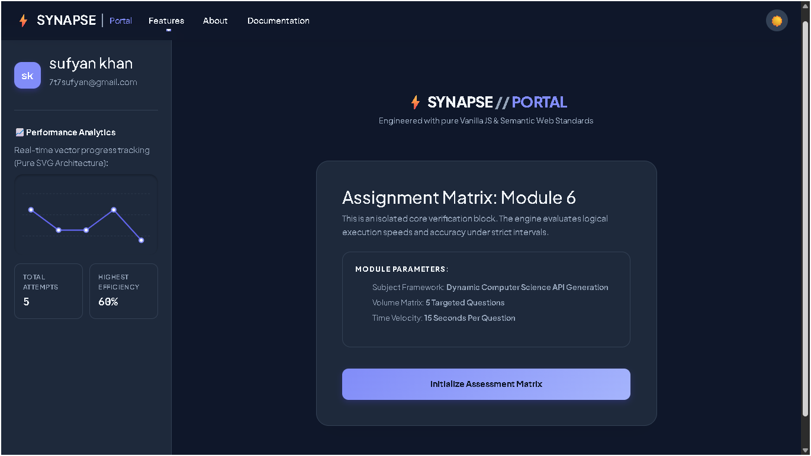

<div align="center">
  <br>
  
  <br>
  <p>
    
  </p>
</div>

<div align="center">
  <h3>🎯 A completely client‑side technical evaluation engine built with zero dependencies.</h3>
  <p>No React, No Angular, No backend — just hand‑crafted HTML, CSS, and JavaScript.</p>
</div>

<br>

<p align="center">
  
</p>

---

## 📋 Table of Contents
- [✨ Features](#-features)
- [🧠 How It Works](#-how-it-works)
- [📸 Live Preview](#-live-preview)
- [🧰 Tech Stack](#-tech-stack)
- [🚀 Getting Started](#-getting-started)
- [🌍 Deployment](#-deployment)
- [🚀 Upcoming Features](#-upcoming-features-roadmap)
- [🙏 Acknowledgments](#-acknowledgments)
- [👤 About the Developer](#-about-the-developer)
- [📄 License](#-license)

---

## ✨ Features

<div style="display: grid; grid-template-columns: repeat(auto-fit, minmax(260px, 1fr)); gap: 16px;">

  <div style="background: linear-gradient(145deg, #1e1e2f, #2a2a40); border-radius: 20px; padding: 20px; box-shadow: 0 10px 30px rgba(108,92,231,0.2); transition: transform 0.2s; border: 1px solid rgba(108,92,231,0.3);">
    <h3 style="color: #a29bfe; margin-top:0;">🧠 Quiz Engine</h3>
    <p style="color: #e0e0e0; font-size: 14px; line-height: 1.5;">Dynamic questions from Open Trivia DB. 5 random CS‑focused items per session. No two runs feel the same.</p>
  </div>

  <div style="background: linear-gradient(145deg, #1e1e2f, #2a2a40); border-radius: 20px; padding: 20px; box-shadow: 0 10px 30px rgba(0,206,201,0.2); transition: transform 0.2s; border: 1px solid rgba(0,206,201,0.3);">
    <h3 style="color: #00cec9; margin-top:0;">⏱️ Precision Timer</h3>
    <p style="color: #e0e0e0; font-size: 14px; line-height: 1.5;">Drift‑free 15s countdown. Audible tick in the last 5 seconds. Auto‑submits on timeout — no mercy!</p>
  </div>

  <div style="background: linear-gradient(145deg, #1e1e2f, #2a2a40); border-radius: 20px; padding: 20px; box-shadow: 0 10px 30px rgba(253,121,168,0.2); transition: transform 0.2s; border: 1px solid rgba(253,121,168,0.3);">
    <h3 style="color: #fd79a8; margin-top:0;">🔊 Read Aloud</h3>
    <p style="color: #e0e0e0; font-size: 14px; line-height: 1.5;">One click reads question + all 4 options. Uses Web Speech API with a British accent. Accessibility win.</p>
  </div>

  <div style="background: linear-gradient(145deg, #1e1e2f, #2a2a40); border-radius: 20px; padding: 20px; box-shadow: 0 10px 30px rgba(85,239,196,0.2); transition: transform 0.2s; border: 1px solid rgba(85,239,196,0.3);">
    <h3 style="color: #55efc4; margin-top:0;">📊 Analytics</h3>
    <p style="color: #e0e0e0; font-size: 14px; line-height: 1.5;">Pure SVG chart paints your score history. Hover effects, glowing dots, and real‑time updates — no chart library.</p>
  </div>

  <div style="background: linear-gradient(145deg, #1e1e2f, #2a2a40); border-radius: 20px; padding: 20px; box-shadow: 0 10px 30px rgba(255,234,167,0.2); transition: transform 0.2s; border: 1px solid rgba(255,234,167,0.3);">
    <h3 style="color: #ffeaa7; margin-top:0;">🌓 Dark / Light Mode</h3>
    <p style="color: #e0e0e0; font-size: 14px; line-height: 1.5;">Full theme toggle that sticks via localStorage. Modals, cards, and SVGs all obey your preference.</p>
  </div>

  <div style="background: linear-gradient(145deg, #1e1e2f, #2a2a40); border-radius: 20px; padding: 20px; box-shadow: 0 10px 30px rgba(225,112,85,0.2); transition: transform 0.2s; border: 1px solid rgba(225,112,85,0.3);">
    <h3 style="color: #e17055; margin-top:0;">💎 Premium UI</h3>
    <p style="color: #e0e0e0; font-size: 14px; line-height: 1.5;">Glassmorphism navbar, animated modals, staggered option cards, and micro‑interactions everywhere.</p>
  </div>

  <div style="background: linear-gradient(145deg, #1e1e2f, #2a2a40); border-radius: 20px; padding: 20px; box-shadow: 0 10px 30px rgba(108,92,231,0.2); transition: transform 0.2s; border: 1px solid rgba(108,92,231,0.3);">
    <h3 style="color: #a29bfe; margin-top:0;">📱 Responsive</h3>
    <p style="color: #e0e0e0; font-size: 14px; line-height: 1.5;">Flawless on mobile, tablet, and desktop. Adaptive grid that respects every screen.</p>
  </div>

  <div style="background: linear-gradient(145deg, #1e1e2f, #2a2a40); border-radius: 20px; padding: 20px; box-shadow: 0 10px 30px rgba(0,206,201,0.2); transition: transform 0.2s; border: 1px solid rgba(0,206,201,0.3);">
    <h3 style="color: #00cec9; margin-top:0;">🔗 Social Links</h3>
    <p style="color: #e0e0e0; font-size: 14px; line-height: 1.5;">About modal packs GitHub, LinkedIn, and Portfolio buttons — fully customisable for your brand.</p>
  </div>

</div>

---

## 🧠 How It Works

<div style="display: flex; flex-direction: column; gap: 30px; margin: 30px 0;">

  <!-- Step 1 -->
  <div style="display: flex; align-items: flex-start; gap: 20px;">
    <div style="min-width: 50px; height: 50px; background: linear-gradient(135deg, #6c5ce7, #a29bfe); border-radius: 50%; display: flex; align-items: center; justify-content: center; color: white; font-weight: bold; font-size: 20px; box-shadow: 0 6px 18px rgba(108,92,231,0.5);">1</div>
    <div style="background: rgba(108,92,231,0.08); border-radius: 16px; padding: 16px; flex: 1; border-left: 4px solid #6c5ce7;">
      <strong style="color: #a29bfe; font-size: 16px;">📡 Fetch Questions</strong><br>
      <span style="color: #cfcfcf;">The app pulls 5 random Computer Science questions from Open Trivia DB on page load.</span>
    </div>
  </div>

  <!-- Step 2 -->
  <div style="display: flex; align-items: flex-start; gap: 20px;">
    <div style="min-width: 50px; height: 50px; background: linear-gradient(135deg, #00cec9, #81ecec); border-radius: 50%; display: flex; align-items: center; justify-content: center; color: white; font-weight: bold; font-size: 20px; box-shadow: 0 6px 18px rgba(0,206,201,0.5);">2</div>
    <div style="background: rgba(0,206,201,0.08); border-radius: 16px; padding: 16px; flex: 1; border-left: 4px solid #00cec9;">
      <strong style="color: #81ecec; font-size: 16px;">🖼️ Render Quiz Interface</strong><br>
      <span style="color: #cfcfcf;">Question + 4 option cards slide in with staggered animation. Timer begins immediately.</span>
    </div>
  </div>

  <!-- Step 3 -->
  <div style="display: flex; align-items: flex-start; gap: 20px;">
    <div style="min-width: 50px; height: 50px; background: linear-gradient(135deg, #fd79a8, #e84393); border-radius: 50%; display: flex; align-items: center; justify-content: center; color: white; font-weight: bold; font-size: 20px; box-shadow: 0 6px 18px rgba(253,121,168,0.5);">3</div>
    <div style="background: rgba(253,121,168,0.08); border-radius: 16px; padding: 16px; flex: 1; border-left: 4px solid #fd79a8;">
      <strong style="color: #e84393; font-size: 16px;">🎯 Choose an Answer</strong><br>
      <span style="color: #cfcfcf;">Click any option — or let the timer run out for auto‑submit. Feedback appears instantly.</span>
    </div>
  </div>

  <!-- Step 4 -->
  <div style="display: flex; align-items: flex-start; gap: 20px;">
    <div style="min-width: 50px; height: 50px; background: linear-gradient(135deg, #ffeaa7, #fdcb6e); border-radius: 50%; display: flex; align-items: center; justify-content: center; color: white; font-weight: bold; font-size: 20px; box-shadow: 0 6px 18px rgba(253,203,110,0.5);">4</div>
    <div style="background: rgba(253,203,110,0.08); border-radius: 16px; padding: 16px; flex: 1; border-left: 4px solid #fdcb6e;">
      <strong style="color: #fdcb6e; font-size: 16px;">📊 Update Score & Chart</strong><br>
      <span style="color: #cfcfcf;">Correct answer? Score goes up. Wrong? No points. SVG chart redraws after every question.</span>
    </div>
  </div>

  <!-- Step 5 -->
  <div style="display: flex; align-items: flex-start; gap: 20px;">
    <div style="min-width: 50px; height: 50px; background: linear-gradient(135deg, #55efc4, #00b894); border-radius: 50%; display: flex; align-items: center; justify-content: center; color: white; font-weight: bold; font-size: 20px; box-shadow: 0 6px 18px rgba(85,239,196,0.5);">5</div>
    <div style="background: rgba(85,239,196,0.08); border-radius: 16px; padding: 16px; flex: 1; border-left: 4px solid #55efc4;">
      <strong style="color: #55efc4; font-size: 16px;">🏁 End Screen & History</strong><br>
      <span style="color: #cfcfcf;">After 5 questions, see your final score. Your history is stored locally and shown as a trend.</span>
    </div>
  </div>

</div>

---

## 📸 Live Preview

<details>
<summary><strong>📖 Essay Introduction (click to expand)</strong></summary>

*Synapse is more than a note‑taking app. It is a quiet rebellion against the rigidity of folders, a love letter to the way your mind actually moves — leaping, looping, connecting fragments across time and discipline. What if your second brain didn’t just store knowledge, but actively helped you grow it? This is the question Synapse dares to answer.*

</details>

---

### Dashboard & Daily Workflow

**1. Main Dashboard – Overview of Your Second Brain**  
<a href="assets/screenshots/dashboard.png" target="_blank">
  <button style="background: linear-gradient(135deg, #6c5ce7, #a29bfe); border: none; color: white; padding: 10px 22px; text-align: center; font-size: 14px; font-weight: 600; border-radius: 30px; cursor: pointer; box-shadow: 0 4px 14px rgba(108, 92, 231, 0.4); transition: all 0.2s ease;"
          onmouseover="this.style.transform='translateY(-2px)'; this.style.boxShadow='0 8px 20px rgba(108, 92, 231, 0.6)';"
          onmouseout="this.style.transform='translateY(0)'; this.style.boxShadow='0 4px 14px rgba(108, 92, 231, 0.4)';">
    🔍 View Full Image
  </button>
</a>

**2. Note Editor – Writing with Linked References**  
<a href="assets/screenshots/editor.png" target="_blank">
  <button style="background: linear-gradient(135deg, #6c5ce7, #a29bfe); border: none; color: white; padding: 10px 22px; text-align: center; font-size: 14px; font-weight: 600; border-radius: 30px; cursor: pointer; box-shadow: 0 4px 14px rgba(108, 92, 231, 0.4); transition: all 0.2s ease;"
          onmouseover="this.style.transform='translateY(-2px)'; this.style.boxShadow='0 8px 20px rgba(108, 92, 231, 0.6)';"
          onmouseout="this.style.transform='translateY(0)'; this.style.boxShadow='0 4px 14px rgba(108, 92, 231, 0.4)';">
    🔍 View Full Image
  </button>
</a>

**3. Graph View – Visualizing Your Knowledge Web**  
<a href="assets/screenshots/graph.png" target="_blank">
  <button style="background: linear-gradient(135deg, #6c5ce7, #a29bfe); border: none; color: white; padding: 10px 22px; text-align: center; font-size: 14px; font-weight: 600; border-radius: 30px; cursor: pointer; box-shadow: 0 4px 14px rgba(108, 92, 231, 0.4); transition: all 0.2s ease;"
          onmouseover="this.style.transform='translateY(-2px)'; this.style.boxShadow='0 8px 20px rgba(108, 92, 231, 0.6)';"
          onmouseout="this.style.transform='translateY(0)'; this.style.boxShadow='0 4px 14px rgba(108, 92, 231, 0.4)';">
    🔍 View Full Image
  </button>
</a>

**4. Daily Note – Journal & Task Tracking**  
<a href="assets/screenshots/daily-note.png" target="_blank">
  <button style="background: linear-gradient(135deg, #6c5ce7, #a29bfe); border: none; color: white; padding: 10px 22px; text-align: center; font-size: 14px; font-weight: 600; border-radius: 30px; cursor: pointer; box-shadow: 0 4px 14px rgba(108, 92, 231, 0.4); transition: all 0.2s ease;"
          onmouseover="this.style.transform='translateY(-2px)'; this.style.boxShadow='0 8px 20px rgba(108, 92, 231, 0.6)';"
          onmouseout="this.style.transform='translateY(0)'; this.style.boxShadow='0 4px 14px rgba(108, 92, 231, 0.4)';">
    🔍 View Full Image
  </button>
</a>

---

## 🧰 Tech Stack

| Layer          | Technology |
|----------------|------------|
| **Markup**     | HTML5 (semantic elements) |
| **Styling**    | CSS3 (custom properties, animations, glassmorphism) + Bootstrap 5 (navbar only) |
| **Logic**      | Vanilla JavaScript (ES6+) – no frameworks |
| **Audio**      | Web Audio API (synthetic tones) + SpeechSynthesis API |
| **Data**       | Open Trivia DB REST API |
| **Charts**     | Pure SVG (hand‑coded paths and dots) |
| **Deployment** | Render (static site) |

---

## 🚀 Getting Started

### Prerequisites
- A modern web browser (Chrome/Firefox/Edge)
- Git (optional)

### Installation

```bash
# Clone the repository
git clone https://github.com/sufyankhan/synapse-portal.git
cd synapse-portal

# Open directly or use a local server
# Option 1: Double‑click index.html
# Option 2: Python server
python -m http.server 8000

# Then visit http://localhost:8000