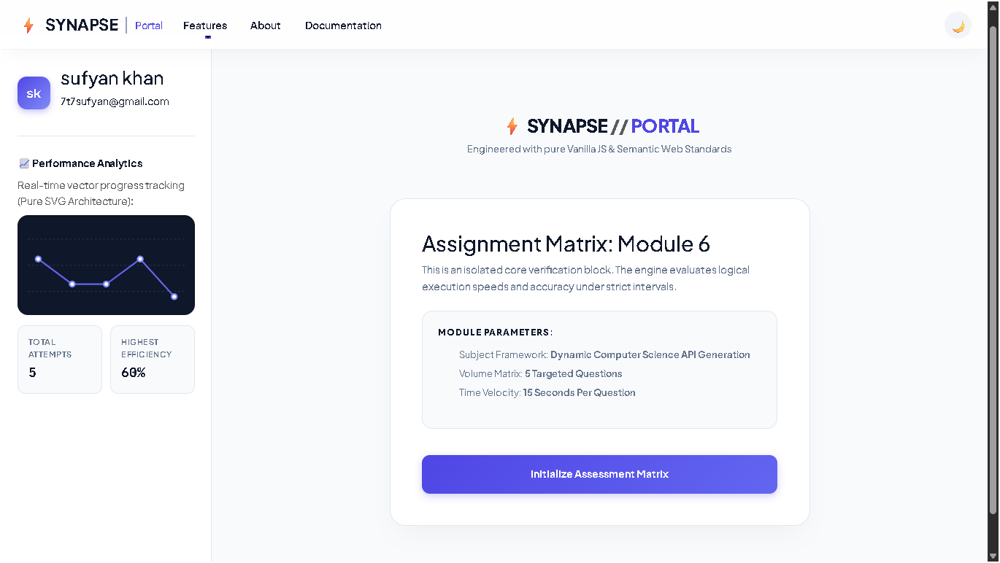
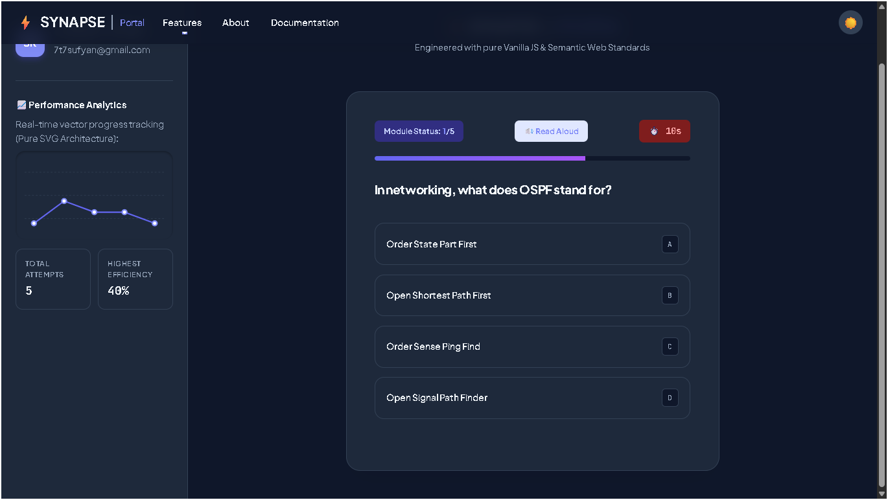
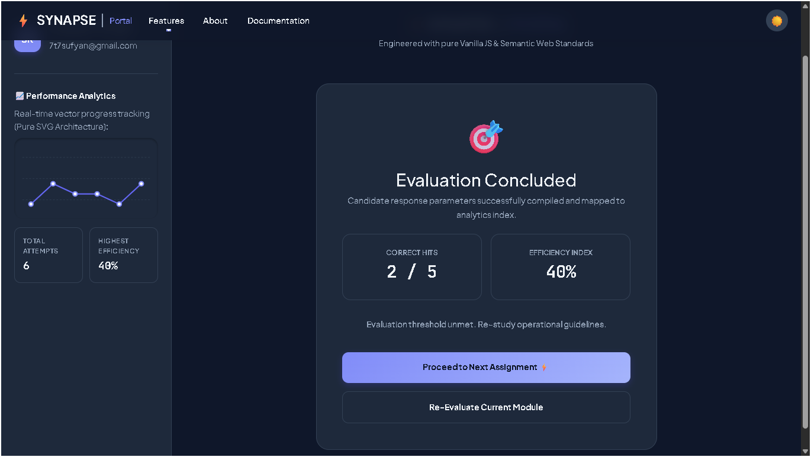

<div align="center">
  <br>
  
  <br>
  <p>
    
  </p>
</div>

<div align="center">
  <h3>🎯 A completely client‑side technical evaluation engine built with zero dependencies.</h3>
  <p>No React, No Angular, No backend — just hand‑crafted HTML, CSS, and JavaScript.</p>
</div>

<br>

<p align="center">
  
</p>

---

## 📋 Table of Contents
- [✨ Features](#-features)
- [📸 Live Preview](#-live-preview)
- [🧰 Tech Stack](#-tech-stack)
- [🚀 Getting Started](#-getting-started)
- [🌍 Deployment](#-deployment)
- [📄 License](#-license)
- [🙏 Acknowledgments](#-acknowledgments)
- [👤 Developer Profile](#-About the Developer)

---

## ✨ Features

| Category         | Highlights |
|------------------|------------|
| 🧠 **Quiz Engine** | Dynamic questions fetched from [Open Trivia DB](https://opentdb.com/). 5 random CS‑focused items per session. |
| ⏱️ **Precision Timer** | Drift‑free countdown (15s) with audible ticks in the last 5 seconds. Auto‑submits on timeout. |
| 🔊 **Read Aloud** | Click a button to hear the question and all four options read out using the Web Speech API (British accent). |
| 📊 **Analytics** | Pure SVG chart visualises your score history. Hover effects and real‑time updates. |
| 🌓 **Dark / Light Mode** | Full theme toggle that persists via `localStorage`. Works across all modals and components. |
| 💎 **Premium UI** | Glassmorphism navbar, animated modals, staggered option cards, and smooth micro‑interactions. |
| 📱 **Responsive** | Fully functional on mobile, tablet, and desktop. Adaptive grid layout. |
| 🔗 **Social Links** | About modal includes GitHub, LinkedIn, and Portfolio buttons (customisable). |

---

## 📸 Live Preview

<div align="center">
  <table>
    <tr>
      <td><strong>🌞 Light Mode</strong></td>
      <td><strong>🌙 Dark Mode</strong></td>
    </tr>
    <tr>
      <td></td>
      <td></td>
    </tr>
    <tr>
      <td><strong>📝 Quiz Session</strong></td>
      <td><strong>🎯 Results & Analytics</strong></td>
    </tr>
    <tr>
      <td></td>
      <td></td>
    </tr>
  </table>
  <p><em>(Actual screenshots in <code>statics/</code> folder)</em></p>
</div>

---

## 🧰 Tech Stack

| Layer          | Technology |
|----------------|------------|
| **Markup**     | HTML5 (semantic elements) |
| **Styling**    | CSS3 (custom properties, animations, glassmorphism) + Bootstrap 5 (navbar only) |
| **Logic**      | Vanilla JavaScript (ES6+) – no frameworks |
| **Audio**      | Web Audio API (synthetic tones) + SpeechSynthesis API |
| **Data**       | Open Trivia DB REST API |
| **Charts**     | Pure SVG (hand‑coded paths and dots) |
| **Deployment** | Render (static site) |

---
## 🙏 Acknowledgments
<table> <tr> <td align="center"> <a href="https://opentdb.com/"></a><br>Free trivia API </td> <td align="center"> <a href="https://ui-avatars.com/"></a><br>Instant avatars </td> <td align="center"> <a href="https://getbootstrap.com/"></a><br>Navbar component </td> </tr> <tr> <td align="center"> <a href="https://fonts.google.com/"></a><br>Typefaces </td> <td align="center"> <a href="https://render.com/"></a><br>Static hosting </td> <td align="center"> <br>Community love </td> </tr> </table>

---

## 🚀 Deployment

 Deploy Your Own Instance
1. **Push** the code to a GitHub repository.
2. Create a new **Static Site** on [Render](https://render.com).
3. Configure:
   - **Build Command:** *leave blank*
   - **Publish Directory:** `.`
4. Click **Create Static Site** – it’s live in seconds 🎉

> Also compatible with:  
>  
>  
> 

---
## 🚀 Upcoming Features (Roadmap)

I'm continuously improving this portal. Here's what's planned:

- [ ] **User Accounts** – Let candidates save their history and resume later.
- [ ] **Custom Question Sets** – Allow examiners to upload their own questions.
- [ ] **Detailed Analytics Export** – Download performance reports as PDF.
- [ ] **Sound Themes** – Choose different tick/feedback sounds.
- [ ] **Multi‑language Support** – Read aloud in Hindi, Urdu, and more.
- [ ] **Leaderboard** – Compare scores with other candidates (mock).

*These additions will transform SYNAPSE from a personal lab into a fully‑fledged assessment platform.*
---
## 👤 About the Developer
<div align="center">  <h3>Sufyan Khan</h3> <p> <strong>FSC Student & Aspiring Software Engineer</strong><br> <em>"I'm learning by building. This portal is my personal lab to master the web without frameworks — every line of code brings me closer to becoming a professional engineer."</em> </p> <p> <a href="https://github.com/sufyankhan"></a> <a href="https://linkedin.com/in/sufyankhan"></a> <a href="https://yourportfolio.com"></a> </p> </div>
<p align="center">Made with ❤️ and a keyboard full of curiosity.</p>

## 🚀 Getting Started

### Prerequisites
- A modern web browser (Chrome/Firefox/Edge)
- Git (optional)

### Installation

```bash
# Clone the repository
git clone https://github.com/sufyankhan/synapse-portal.git
cd synapse-portal

# Open directly or use a local server
# Option 1: Double‑click index.html
# Option 2: Python server
python -m http.server 8000

# Then visit http://localhost:8000